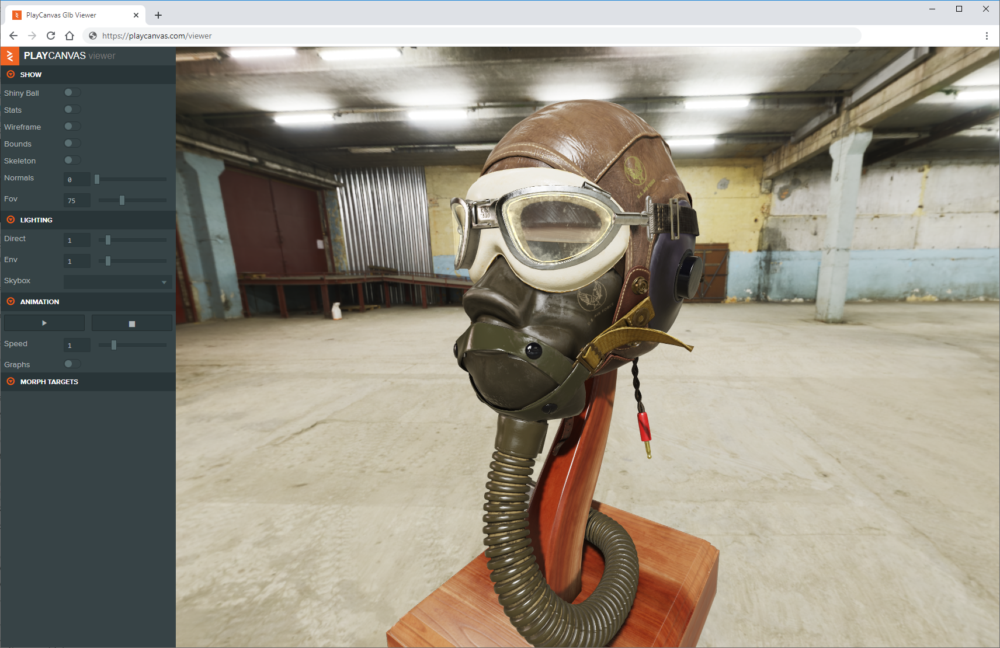

# PlayCanvas glTF Viewer

The PlayCanvas glTF scene viewer is blazingly fast and 100% compliant with the glTF 2.0 spec. 

You can find a live version at:

https://playcanvas.com/viewer

The viewer can load any glTF 2.0 scene. Embedded glTF and binary glTF (GLB) can be dragged directly into the 3D view. To load an unpacked glTF scene, drag its parent folder into the 3D view. You can also load scenes via the `load` URL query parameter. An example would be:

https://playcanvas.com/viewer/?load=https://raw.githubusercontent.com/KhronosGroup/glTF-Sample-Models/master/2.0/DamagedHelmet/glTF-Binary/DamagedHelmet.glb

You can also drag and drop images into the 3D view to set a background. Options are:

* Single file images are treated as equirectangular projections. Supported formats are PNG, JPG and HDR. Find high quality HDR images at [HDRHaven](https://hdrihaven.com/).
* Six images are treated as cube map faces. Naming should be one of the following 5 forms, where each face name below should be incorporated in the overall filename like `name_posx.png` for example:

| Face 0  | Face 1  | Face 2  | Face 3  | Face 4  | Face 5  |
|---------|---------|---------|---------|---------|---------|
| posx    |  negx   | posy    | negy    | posz    | negz    |
| px      |  nx     | py      | ny      | pz      | nz      |
| right   |  left   | up      | down    | front   | back    |
| right   |  left   | top     | bottom  | forward | backward|
| 0       |  1      | 2       | 3       | 4       | 5       |

## How to build

Ensure you have [Node.js](https://nodejs.org) installed (v10.0+). Then, from a command prompt, run:

    npm install
    npm run build

This will invoke Webpack and output the built viewer to the `dist` folder. To invoke Webpack with the `--watch` flag (which rebuilds the viewer on saving any source file), do:

    npm run build:watch

## How to run

Run:

    npm run serve

Open a browser and navigate to http://localhost:5000.
